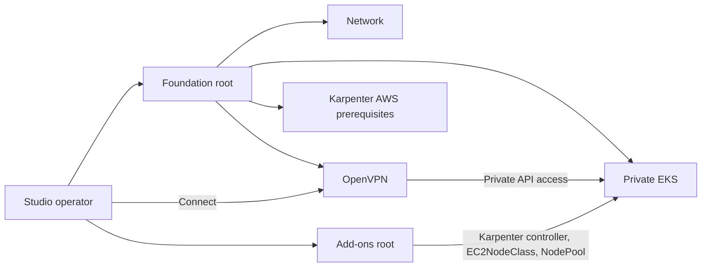

# UnrealOps Infrastructure

[](https://github.com/UnrealOps/infrastructure/actions/workflows/ci.yml)
[](https://github.com/UnrealOps/infrastructure/releases)
[](LICENSE)

⭐ Star the repository if reusable Unreal Engine infrastructure is useful to
your team.

Deploy an isolated AWS foundation for Unreal Engine game development with
reusable Terraform and OpenTofu modules: a private Amazon EKS cluster, efficient
Karpenter capacity, and a self-hosted OpenVPN Community gateway.

📚 Find UnrealOps tutorials on
[Substack](https://substack.com/@unrealops) and the
[Epic Developer Community](https://dev.epicgames.com/community/profile/l5XZw/UnrealOps).

## Table of Contents

- [About](#-about)
- [Architecture](#-architecture)
- [Quickstart](#-quickstart)
- [Supported Modules](#-supported-modules)
- [Documentation and Tutorials](#-documentation-and-tutorials)
- [Contributing](#-contributing)
- [License](#-license)

## 🚀 About

UnrealOps Infrastructure is the first vertical slice of a reusable cloud
platform for game studios. It provides the network and Kubernetes foundation on
which teams can later host build, source-control, content, and game-server
workloads.

- **Isolated by default** — the EKS API is private-only and worker nodes run in
  private subnets across three Availability Zones.
- **Practical remote access** — OpenVPN Community provides employee access
  without AWS Client VPN hourly connection charges.
- **Elastic workload capacity** — Karpenter provisions Spot or On-Demand nodes
  and consolidates unused capacity.
- **Stable system capacity** — a default two-node, On-Demand AL2023 managed
  node group keeps core controllers available.
- **Secure foundations** — EKS secrets encryption, control-plane logs, VPC flow
  logs, IMDSv2, encrypted volumes, and SSM administration are enabled.
- **Reusable and testable** — small modules support both Terraform and OpenTofu,
  with contract tests and opt-in live Terratest coverage.

## 🏗️ Architecture

Deployment is split into two roots because Kubernetes and Helm providers cannot
reach the private EKS API until the operator connects through OpenVPN.



Apply `terraform/examples/complete/foundation` first. After connecting through
OpenVPN, apply `terraform/examples/complete/addons` with the same cluster name.
The add-ons root discovers the cluster and Karpenter prerequisites from AWS; it
does not read foundation Terraform state.

## ⚡ Quickstart

### Prerequisites

Use an isolated AWS account with sufficient EKS, EC2, NAT gateway, EIP, IAM,
KMS, and VPC quotas. Install OpenTofu or Terraform, AWS CLI v2, kubectl,
OpenVPN, Go, GNU Make, TFLint, Trivy, `curl`, `jq`, OpenSSL, `tar`, and a
SHA-256 utility.

> [!WARNING]
> The complete example creates billable EKS, NAT gateway, public IPv4, EC2,
> CloudWatch, KMS, and Secrets Manager resources. Review every plan and destroy
> evaluation environments promptly.

### 1. Prepare the environment

```bash
git clone https://github.com/UnrealOps/infrastructure.git
cd infrastructure

aws sts get-caller-identity --region us-west-2
cp terraform/examples/complete/foundation/terraform.tfvars.example \
  terraform/examples/complete/foundation/terraform.tfvars
cp terraform/examples/complete/addons/terraform.tfvars.example \
  terraform/examples/complete/addons/terraform.tfvars

make vpn-pki-init ENV=studio-dev AWS_REGION=us-west-2
```

Add the returned runtime secret ARN and durable administrator principals to
`terraform/examples/complete/foundation/terraform.tfvars`.

### 2. Apply the foundation

```bash
make foundation-init ENGINE=tofu
tofu -chdir=terraform/examples/complete/foundation plan
tofu -chdir=terraform/examples/complete/foundation apply

make vpn-client ENV=studio-dev USER="$USER" \
  ENDPOINT="$(tofu -chdir=terraform/examples/complete/foundation output -raw openvpn_endpoint)"
```

Connect using the generated OpenVPN profile. Set the add-ons `cluster_name` to
the foundation `name`, then apply the Kubernetes resources:

```bash
make addons-init ENGINE=tofu
tofu -chdir=terraform/examples/complete/addons plan
tofu -chdir=terraform/examples/complete/addons apply
```

These commands use local state for evaluation. Use the
[`deploy-unrealops-infrastructure`](.agents/skills/deploy-unrealops-infrastructure/SKILL.md)
runbook to configure separate encrypted and locked remote state for durable
environments.

### 3. Destroy in dependency order

Remain connected to OpenVPN while destroying the add-ons:

```bash
tofu -chdir=terraform/examples/complete/addons destroy
tofu -chdir=terraform/examples/complete/foundation destroy
```

The runtime secret and offline certificate authority are intentionally outside
these Terraform roots. Retire them separately according to studio policy.

## 🧩 Supported Modules

| Module | Purpose |
| --- | --- |
| [`network`](terraform/modules/network) | Three-AZ VPC, private EKS subnets, per-AZ NAT, VPN subnets, flow logs, and S3 endpoint |
| [`openvpn`](terraform/modules/openvpn) | Self-healing OpenVPN Community instance with a stable Elastic IP and offline CA workflow |
| [`eks`](terraform/modules/eks) | Private EKS control plane, managed add-ons, encryption, access entries, and AL2023 system nodes |
| [`karpenter-infra`](terraform/modules/karpenter-infra) | Karpenter IAM, Pod Identity, interruption queue, and EKS access entry |
| [`cluster-addons`](terraform/modules/cluster-addons) | Karpenter controller, CRDs, EC2NodeClass, and general-purpose NodePool |

## 📚 Documentation and Tutorials

- [Complete foundation example](terraform/examples/complete/foundation)
- [Complete add-ons example](terraform/examples/complete/addons)
- [Deployment skill and runbook](.agents/skills/deploy-unrealops-infrastructure/SKILL.md)
- [Testing and cleanup skill](.agents/skills/test-unrealops-infrastructure/SKILL.md)
- [UnrealOps on Substack](https://substack.com/@unrealops)
- [UnrealOps on the Epic Developer Community](https://dev.epicgames.com/community/profile/l5XZw/UnrealOps)

## 🤝 Contributing

Issues and focused pull requests are welcome. Have your agents read
[`AGENTS.md`](AGENTS.md) for the supported scope, project layout, validation
commands, coding conventions, Conventional Commit format, and release policy.
Infrastructure PRs must describe cost impact, migration or rollback concerns,
and the commands used for validation.

## 📃 License

UnrealOps Infrastructure is available under the [MIT License](LICENSE).

[Back to top](#unrealops-infrastructure)
