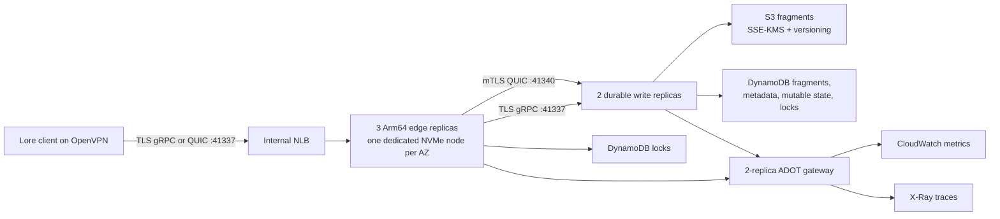

# Lore on private EKS

Lore is an opt-in binary-asset service layered onto the repository's existing
foundation → OpenVPN → add-ons lifecycle. It does not add public ingress,
application identity, game-service infrastructure, or Lore's plaintext HTTP
content path.

## Architecture



The frontend security group accepts TCP and UDP `41337` only from the
customer-managed OpenVPN source prefix list. The load balancer is always
internal, terminates no TLS, and uses HTTP `/health_check` on pod port `41339`
without creating a client listener for that port.

Edge pods have no S3 or mutable-table permissions. They can read the runtime
certificate secret and use the shared DynamoDB lock table. Write pods own the
durable S3 and four-table access. The ADOT gateway has a third identity scoped
to `UnrealOps/Lore` metrics, its metric log group, and X-Ray writes.
Workload availability, restart, and edge-storage alarms use the PromQL-native
metrics emitted by OTel Container Insights; AWS/NLB and Lore application
metrics remain ordinary CloudWatch metric alarms.
Lore pods can reach only DNS, their explicit inter-tier/OTLP peers, AWS HTTPS
endpoints outside the VPC address range, and the EKS Pod Identity credential
endpoint. Other VPC lateral traffic remains denied.

## Lifecycle

1. Initialize the independent encrypted Lore CA:

   ```bash
   make lore-pki-init CLUSTER_NAME=studio-dev AWS_REGION=us-west-2
   ```

2. Set `enable_lore = true` in the foundation root and apply it.
3. Publish the image with the protected `Lore image` workflow.
4. Copy the printed `repository@sha256:...` URI into the add-ons
   `lore_image`.
5. Connect through OpenVPN and apply add-ons with `enable_lore = true`.
6. Export and install the public CA certificate:

   ```bash
   make lore-ca CLUSTER_NAME=studio-dev \
     LORE_CA_OUTPUT=studio-dev-lore-ca.crt
   ```

7. Destroy add-ons before foundation. Keep `lore_force_destroy = false` for
   durable environments.

The runtime secret is external to Terraform. `lore-pki.sh rotate` preserves the
CA and creates a new Secrets Manager version. Lore reads certificates at
startup, so restart `lore-write` one pod at a time and verify it before rolling
`lore-edge`. The certificate exporter alarms when fewer than 30 days remain.

## Image publisher identity

Protect a GitHub environment named `lore-image` and define:

| Variable | Purpose |
| --- | --- |
| `AWS_LORE_IMAGE_ROLE_ARN` | OIDC-assumed external publisher role |
| `AWS_ACCOUNT_ID` | Allowed AWS account ID |
| `AWS_REGION` | Foundation region |
| `AWS_LORE_ECR_REPOSITORY` | `${cluster_name}/lore-server` |

The role trust policy should restrict `token.actions.githubusercontent.com` to
this repository, the `lore-image` environment, and the intended branch. Its
permissions need `ecr:GetAuthorizationToken` on `*` and the following actions
on only the foundation repository ARN:

- `ecr:BatchCheckLayerAvailability`
- `ecr:BatchGetImage`
- `ecr:CompleteLayerUpload`
- `ecr:DescribeImages`
- `ecr:GetDownloadUrlForLayer`
- `ecr:InitiateLayerUpload`
- `ecr:PutImage`
- `ecr:UploadLayerPart`

The workflow builds the pinned Lore commit for `linux/amd64` and `linux/arm64`,
pushes version and commit tags, attaches SBOM and provenance manifests, and
keylessly signs the returned manifest digest. It never publishes `latest`.

## Acceptance testing

The guarded acceptance wrapper preserves the existing non-Lore run unless Lore
is explicitly enabled. To exercise the full two-tier path, install `crane` and
provide an immutable source image from a stable repository in the same private
ECR registry plus an executable Lore v0.8.5 client built from the revision in
`docker/lore/source.env`:

```bash
.agents/skills/test-unrealops-infrastructure/scripts/run-acceptance.sh \
  --engine tofu \
  --account-id 123456789012 \
  --region us-west-2 \
  --run-id lore-12345 \
  --lore-image 123456789012.dkr.ecr.us-west-2.amazonaws.com/lore-acceptance@sha256:<digest> \
  --lore-client /absolute/path/to/lore \
  --confirm-billable
```

After foundation creates the run-specific repository, the test mirrors and
verifies both image platforms, then deploys the destination digest. The wrapper
creates an isolated encrypted Lore CA and runtime secret, verifies the AWS
storage and private-endpoint controls, exercises TLS and QUIC, pushes and clones
a binary tree, checks fragment deduplication and shared locks, disrupts a write
replica during a push, replaces an edge node, validates durable cache
reconstruction, exercises S3 version recovery and DynamoDB PITR, and proves the
default service account has no usable AWS workload credentials. It retains
state, PKI, and secrets whenever cleanup cannot be proven.

## Cost and rollback

The balanced default creates three `c8gd.4xlarge` edge nodes plus write
capacity, S3, four on-demand DynamoDB tables, CloudWatch ingestion, X-Ray
traces, and an internal NLB. Existing deployments pay none of these Lore costs
while `enable_lore = false`.

Rollback the workload by reapplying add-ons with a previously signed immutable
digest. Storage remains forward-compatible because a rollback does not replace
the bucket or tables. Before any destructive foundation rollback, restore
DynamoDB to temporary tables with PITR and validate S3 versions. Do not disable
table deletion protection or force-delete storage merely to make a failed
destroy pass.
